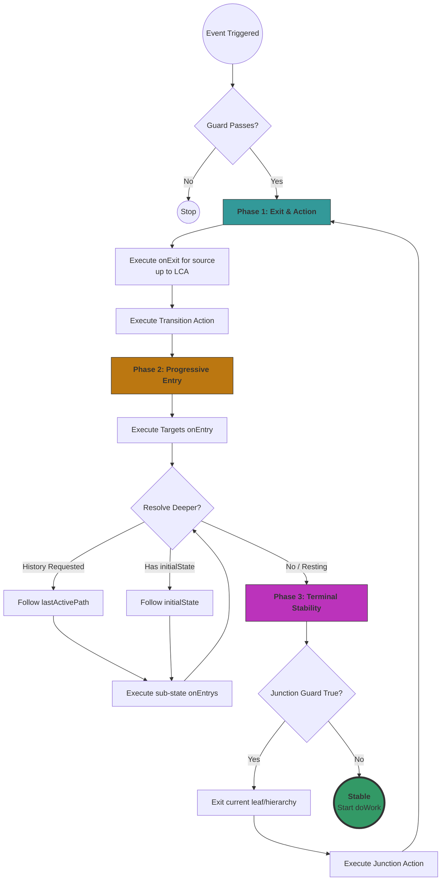

# PRD: Hierarchical State Machine (Dart) – "Precise Semantics" Overhaul v2

## 1. Vision & Objective

Revise the `hierarchical-state-machine.dart` library to align with **UML 2.5.1** and **PSSM (Precise Semantics)**. The overhaul eliminates ambiguity in complex hierarchies and state transitions while maintaining a flexible, developer-friendly, code-first Dart API that supports "resting" composite states and virtual junctions.

## 2. Core Architectural Pillars

### 2.1. The "Smart Target" Transition Model

Update `EventHandler` to include `HistoryType { none, shallow, deep }`.

**Logic**: The source state specifies the intent (restore history); the engine resolves the path using the target's `lastActivePath`. If null, it falls back to the target's `initialState`.

* **Restoration Precedence:**
1. **History Requested:** If `lastActivePath` exists, follow it based on type (Shallow = first item, Deep = full path).
2. **Fallback/Direct:** If no history exists or `HistoryType.none`, follow the defined `initialState`.

### 2.2. Virtual Junctions (Eventless Handlers)

Replaces the need for a separate `Junction` class with specialized transition lists.

* **Dual-List Structure:** States maintain `eventHandlers` (external triggers) and `junctions` (eventless transitions).
* **The Stability Phase:** Immediately after `onEntry` of the stable state, the machine evaluates `junctions`. If a guard is true, it triggers an automatic transition. This repeats until the machine reaches a state where no completion guards are true.

### 2.3. "Resting" Composite States

Formally support states that have children but no defined `initialState`.

* **Behavior:** The machine is considered "stable" at the parent level. Events bubble starting from this parent state.
* **Stability Logic:** The "Terminal Stability" phase of entry stops at a composite state if no `initialState` is defined.

### 2.4. Deterministic Parallel Behavior

* **Join Logic:** When a child region reaches a `FinalState`, the runner re-evaluates the **parent state's** `completionHandlers`.
* **Teardown Order:** Regions are exited in the deterministic order of their declaration in the Dart API.

---

## 3. Functional Requirements

### 3.1. Three-Phase Entry Protocol

The transition engine must follow this strict sequence to ensure all behaviors (Entry/Initial/History) fire correctly:

1. **Phase 1 (Resolve Path):** Calculate the entry chain based on `HistoryType` and `lastActivePath`.
2. **Phase 2 (Sequential Entry):** Execute `onEntry()` for every state in that chain (Out-to-In).
3. **Phase 3 (Terminal Stability):** Once the chain is exhausted, check if the last state has an `initialState`. If yes, transition and repeat until a leaf or "resting" composite is reached.

### 3.2. History Recording

* **Mechanism:** Capture the active leaf-path (list of State IDs) at the moment a transition is calculated to leave a composite state.
* **Memory Slot:** Only record for states where `historyEnabled` is true.

### 3.3. Event Deferral & Replay

* **Head of Line:** When entering a state that does not defer an event previously in the `DeferredQueue`, that event is moved to the **front** of the main `EventQueue`.
* **Re-deferral:** If the new state also defers the event, it is returned to the deferred pool.

---

## Flow

This is the actual flow for event handling.



---

## 4. Technical Specification (Dart)

### 4.1. Split Handler Implementation

```dart
class State {
  // Handlers triggered by external events
  final Map<Type, List<EventHandler>> eventHandlers = {};
  
  // Handlers triggered at the rest phase of a transition, in the leaf only.
  final List<JunctionHandler> junctions = [];

  // Handlers triggered by state stability (Joins) or all children of an
  // orthogonal state enter final state.
  final List<CompletionHandler> completionHandlers = [];
  
  String? lastActivePath; 
  bool historyEnabled = false;
}

```
