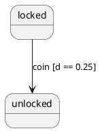

# PRD: hierarchical_state_machine_plantuml

## 1. Executive Summary

The goal of this project is to provide a visualization bridge for the `hierarchical_state_machine` (HSM) library. By converting a `MachineBlueprint` into PlantUML format, developers can automatically generate up-to-date documentation, verify state hierarchies, and debug complex transition logic through visual diagrams.

## 2. Functional Requirements

### 2.1 State Representation

The library must recursively traverse the state tree and map HSM state types to PlantUML syntax.

* **Leaf States:** Rendered as standard states.
* **Composite States:** Rendered using the `state Name { ... }` syntax. The hierarchy must be preserved exactly as defined in the blueprint.
* **Orthogonal (Parallel) Regions:** Regions within a state must be separated by the horizontal separator (`--`) or vertical separator (`||`).
* **Initial States:** The `.initial` property of a composite state must be rendered as an arrow from the start point: `[*] --> InitialStateName`.

### 2.2 Transition Mapping

Transitions defined in the `on: {}` map of each state must be converted to PlantUML arrows.

* **Syntax:** `SourceState --> TargetState : EventName [Guard] / Action`.
* **Event Labels:** Use the `toString()` or a custom formatter for the Event enum/class.
* **Guards:** If a guard is present on a transition, it should be wrapped in square brackets (e.g., `[is_valid]`).
* **Actions:** Transition actions should be listed after a forward slash `/`.
* **Internal Transitions:** Transitions that do not change the state (target is self or null) should be rendered as self-pointing arrows or notes if supported.

### 2.3 Pseudo-state Support

The implementation must handle HSM's specialized pseudo-states:

* **Choice States:** Map to `state choice_name <<choice>>`. Transitions leading to and from the choice point must reflect the branching logic.
* **History States:** Map to `[H]` for shallow history and `[H*]` for deep history.
* **Final States:** Map to the end point symbol `[*]`.
* **Terminate States:** Rendered using the `<<end>>` stereotype or a terminal symbol.
* **Forks/Joins:** Map to `<<fork>>` and `<<join>>` stereotypes respectively.

### 2.4 Metadata and Notes

* **State Descriptions:** If a state has a description or metadata, it should be added as a note: `note right of StateName : Description`.
* **Entry/Exit Actions:** These should be rendered inside the state body: `StateName : entry / actionName` and `StateName : exit / actionName`.

## 3. Technical Specification

### 3.1 API Surface

The library should expose a simple extension or utility class:

```dart
// Class usage
String puml = PlantUmlEncoder().encode(myBlueprint);
// Extension usage
String puml = myBlueprint.toPlantUml();
```

### 3.2 Conversion Logic

1. **Header:** Always start the output with `@startuml` and end with `@enduml`.
2. **State Declaration Pass:** A first pass to declare all states, especially those with long names or stereotypes (e.g., `state "Long State Name" as S1`).
3. **Recursive Traversal:**

* Start at the `root` state.
* For each child, if it is composite, open a `{}` block and recurse.
* Define the `[*] -->` transition for the `initial` child of the current composite, noting ": initialAction" if present.

1. **Transition Pass:** After defining the states, iterate through the transition table to draw arrows. Use fully qualified names (e.g., `Parent.Child`) if necessary to avoid name collisions in deep hierarchies.

### 3.3 Formatting Options

The encoder should accept a configuration object to control:

* **Direction:** Top-to-bottom vs. Left-to-right (`left to right direction`).
* **Theme:** Ability to inject `skinparam` blocks for customized colors and fonts.
* **Detail Level:** Toggle for showing/hiding guards, actions, or entry/exit logic to reduce diagram clutter.

## 4. Example Output Mapping

**Input Blueprint Snippet:**

```dart
.composite(
  id: States.locked,
  on: { Events.coin: .new(guard: (e, d) => d == 0.25, target: States.unlocked) },
)
```

**Generated PlantUML:**



## 5. Non-Functional Requirements

* **Zero Dependencies:** The library should only depend on `hierarchical_state_machine` and standard Dart libraries to keep the footprint small.
* **Performance:** The serialization should be efficient enough to run in a browser (Flutter Web) for real-time visualization tools.
* **Test Coverage:** Comprehensive tests for nested hierarchies, parallel regions, and name collision handling.

## 6. Out of Scope

* **Image Rendering:** This library produces text; rendering the text into a PNG/SVG is the responsibility of the PlantUML server or CLI.
* **Interactive Editing:** The library is for export-only, not for two-way synchronization.